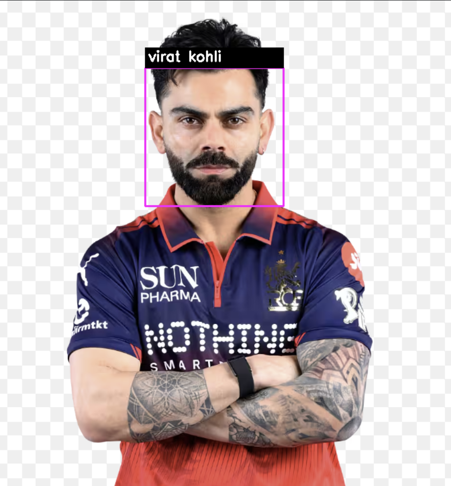

<div align="center">


<br/><br/>

# 🎯 Face Recognition System

**A computer vision project that detects and recognizes Indian cricket players using deep learning-based face embeddings — trained on the 2018 India BGT Test Squad.**

</div>

---

## 🔭 Overview

This system uses **InsightFace's buffalo_l model** with **cosine similarity matching** to identify known individuals from a local image database. Built entirely in Python — no cloud, no API keys, runs fully offline.

---

## ✨ Features

- Detects and recognizes multiple faces in a single image
- Supports multiple reference images per person for better accuracy
- Cosine similarity-based matching (more accurate than L2 distance)
- Native Mac/Windows **file browser** for selecting test images
- Outputs labeled image with bounding boxes saved as `result.jpg`

---

## 📸 Sample Output



---

## ⚙️ Installation

```bash
git clone https://github.com/satwiktelang18/Face-Recognition-System.git
cd Face-Recognition-System
pip install -r requirements.txt
```

---

## ▶️ Usage

```bash
python3 main.py
```

A **native file browser** will open — simply select any image from your computer. Results are automatically saved as `result.jpg`.

---

## 🧠 How It Works

```
1. Load reference images from /database
2. Generate 512-d face embeddings via InsightFace (buffalo_l)
3. A file browser opens — select your test image
4. Compare embeddings using cosine similarity
5. Label matched faces above threshold — Unknown otherwise
```

---

## 🎯 Accuracy Tips

- Use well-lit, front-facing reference images
- Add 5–10 varied images per person for best results
- Adjust `THRESHOLD` in `main.py` (default: `0.4`) if getting false unknowns

---

## 🛠️ Tech Stack

| Tool | Purpose |
|------|---------|
| Python 3 | Core language |
| InsightFace (buffalo_l) | Face detection & embedding |
| OpenCV | Image processing & rendering |
| NumPy | Embedding comparison |
| Tkinter | Native file browser |

---

## 🚀 Roadmap

- [ ] Real-time webcam recognition
- [ ] Confidence score overlay on output
- [ ] Web interface via Streamlit
- [ ] Pre-save embeddings to skip reload on every run

---

## 👨‍💻 Author

**Satwik Telang**